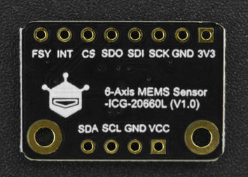

# DFRobot_AHT20

* [English Version](./README.md)

AHT20是一款测量温湿度的温湿度传感器，采用数字输出，I2C接口，用户可通过I2C接口读取测量的温度和湿度。DFRobot采用AHT20芯片设计的此款温湿度传感器具有以下特点:
1. 采集环境温度，单位：摄氏度（℃)，范围-40 ~ 85℃，分辨率：0.01，误差：±0.3 ~ ±1.6 ℃
2. 采集环境相对湿度，单位：%RH,范围0 ~ 100%RH，分辨率0.024%RH，误差：25℃时，误差范围±2 ~ ±5%RH
3. 采用I2C接口，默认I2C地址为0x38
4. uA级传感器，实测最大不超过200uA。
5. 供电范围3.3~5V。

 


## 产品链接（[www.dfrobot.com](www.dfrobot.com)）
    SKU: SEN0527
    SKU: SEN0528
   
## 目录

* [概述](#概述)
* [库安装](#库安装)
* [方法](#方法)
* [兼容性](#兼容性)
* [历史](#历史)
* [创作者](#创作者)

## 概述

提供一个Arduino库给AHT20传感器，以获取该传感器测量的温度和湿度数据，此库具有以下功能：
1. 获取摄氏度温度数据；
2. 获取华摄氏度温度数据，此数据通过摄氏度温度数据计算而来；
3. 获取湿度数据。
4. 复位传感器，恢复其初始状态

## 库安装

这里有2种安装方法：
1. 使用此库前，请首先下载库文件，将其粘贴到\Arduino\libraries目录中，然后打开examples文件夹并在该文件夹中运行演示。
2. 直接在Arduino软件库管理中搜索下载 DFRobot_AHT20 库

## 方法

```C++
  /**
   * @fn DFRobot_AHT20
   * @brief DFRobot_AHT20构造函数
   * @param wire TwoWire类对象引用
   * @return NONE
   */
  DFRobot_AHT20(TwoWire &wire = Wire);
  /**
   * @fn begin
   * @brief AHT20传感器初始化
   * @return 初始化状态值
   * @retval  0    初始化成功
   * @retval  1    _pWire为NULL，请检查构造DFRobot_AHT20是否正确传入了一个TwoWire类对象引用
   * @retval  2    设备未找到，请检查连线是否正确
   * @retval  3    传感器初始化失败，请检查传感器是否有问题，可调用reset函数，还原传感器后，再重新初始化
   */
  uint8_t begin();
  /**
   * @fn reset
   * @brief 传感器软复位，将传感器恢复到初始状态。
   * @return NONE
   */
  void reset();
  /**
   * @fn startMeasurementReady
   * @brief 启动测量，并判断测量数据是否完成。
   * @param crcEn 测量时是否使能校验检测
   * @n     false  不带校验检测测量(默认)
   * @n     true   带校验检测测量
   * @return 测量数据是否完成
   * @retval true  此次测量完成，可调用get*等相关函数，获取测量的数据
   * @retval false 此次测量失败，如果此时调用get*等相关函数，获取的数据是上一次测量的数据，或初始值0
   */
  bool startMeasurementReady(bool crcEn = false);
  /**
   * @fn getTemperature_F
   * @brief 获取环境温度，单位：华摄氏度（F）。
   * @return 华摄氏度温度
   * @note  AHT20不可直接获取华摄氏度温度，这里的华摄氏度温度是根据算法计算出来的： F = C x 1.8 + 32
   * @n 用户调用此函数，必须先调用一次startMeasurementReady函数，来启动测量，才能获取到实时的测量数据，
   * @n 否则将获取到初始数据或上一次测量数据
   */
  float getTemperature_F();
  /**
   * @fn getTemperature_C
   * @brief 获取环境温度，单位：摄氏度（℃）。
   * @return 摄氏度温度，范围-40 ~ 85℃为正常数据，否则为错误数据
   * @note 用户调用此函数，必须先调用一次startMeasurementReady函数，来启动测量，才能获取到实时的测量数据，
   * @n 否则将获取到初始数据或上一次测量数据
   */
  float getTemperature_C();
  /**
   * @fn getHumidity_RH
   * @brief 获取环境相对湿度，单位：%RH。
   * @return 相对湿度，范围0~100
   * @note 用户调用此函数，必须先调用一次startMeasurementReady函数，来启动测量，才能获取到实时的测量数据，
   * @n 否则将获取到初始数据或上一次测量数据
   */
  float getHumidity_RH();
```

## 兼容性

MCU                |  Work Well    | Work Wrong   | Untested    | Remarks
------------------ | :----------: | :----------: | :---------: | -----
Arduino Uno        |       √       |              |             | 
Mega2560           |      √       |              |             | 
Leonardo           |      √       |              |             | 
ESP32              |      √       |              |             | 
ESP8266            |      √       |              |             | 
micro:bit          |      √       |              |             | 
FireBeetle M0      |      √       |              |             | 

## 历史

- 2022/02/09 - 1.0.0 版本

## 创作者

Written by Arya(xue.peng@dfrobot.com), 2022. (Welcome to our [website](https://www.dfrobot.com/))


