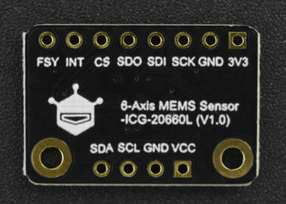

# DFRobot_AHT20

* [中文版](./README_CN.md)

This AHT20 temperature & humidity sensor employs digital output and I2C interface, through which users can read the measured temperature and humidity. Based on the AHT20 chip, it offers the following features:
1. Collect ambient temperature, unit Celsius (℃), range -40-85℃, resolution: 0.01, error: ±0.3-±1.6℃
2. Collect ambient relative humidity, unit: %RH, range 0-100%RH, resolution 0.024%RH, error: when the temprature is 25℃, error range is ±2-±5%RH
3. Use I2C interface, I2C address default to be 0x38
4. uA level sensor, the measuring current supply is less than 200uA.
5. Power supply range 3.3-5V

 


## 产品链接（[www.dfrobot.com](www.dfrobot.com)）
    SKU: SEN0527
    SKU: SEN0528
   
## Table of Contents

* [Summary](#summary)
* [Installation](#installation)
* [Methods](#methods)
* [Compatibility](#compatibility)
* [History](#history)
* [Credits](#credits)

## Summary
Provide AHT20 sensor with an Arduino library to obtain the temperature and humidity data measured by the sensor. This library provides the following functions:
1. Get temperature data in Celsius;
2. Get temperature data in Fahrenheit, which is calculated from the data in Celsius;
3. Get humidity data;
4. Reset the sensor and restore its initial status

## Installation
1. To use this library, first download the library file<br>
```python
sudo git clone https://github.com/DFRobot/DFRobot_AHT20
```
2. Open and run the routine. To execute a routine demo_x.py, enter python demo_x.py in the command line. For example, to execute the demo_read_aht20.py routine, you need to enter :<br>

```python
python demo_read_aht20.py 
or
python2 demo_read_aht20.py 
or 
python3 demo_read_aht20.py
```

## Methods

```python
  '''!
    @brief   Initialize AHT20 sensor
    @return  Init status value
    @retval True  Init succeeded
    @retval False Init failed
  '''
  def begin(self):

  '''!
    @brief   Sensor soft reset, restore the sensor to the initial status
    @return  NONE
  '''
  def reset(self):
    
  '''!
    @brief   Start measurement and determine if it's completed.
    @param crc_en Whether to enable check during measurement
    @n     True  If the measurement is completed, call a related function such as get* to obtain the measured data.
    @n     False If the measurement failed, the obtained data is the data of last measurement or the initial value 0 if the related function such as get* is called at this time.
    @return  Whether the measurement is done
    @retval True  If the measurement is completed, call a related function such as get* to obtain the measured data.
    @retval False If the measurement failed, the obtained data is the data of last measurement or the initial value 0 if the related function such as get* is called at this time.
  '''
  def start_measurement_ready(self, crc_en = False):
    
  '''!
    @brief   Get ambient temperature, unit: Fahrenheit (F).
    @return  Temp in Fahrenheit
    @note  AHT20 can't directly get the temp in F, the temp in F is calculated according to the algorithm: F = C x 1.8 + 32
    @n  Users must call the start_measurement_ready function once before calling the function to start the measurement so as to get the real-time measured data,
    @n  otherwise what they obtained is the initial data or the data of last measurement.
  '''
  def get_temperature_F(self):

  '''!
    @brief   Get ambient temperature, unit: Celsius (℃).
    @return  Temperature in ℃, it's normal data within the range of -40-85℃, otherwise it's wrong data
    @note  Users must call the start_measurement_ready function once before calling the function to start the measurement so as to get the real-time measured data,
    @n  otherwise what they obtained is the initial data or the data of last measurement.
  '''
  def get_temperature_C(self):
    
  '''!
    @brief   Get ambient relative humidity, unit: %RH.
    @return  Relative humidity, range 0-100
    @note  Users must call the start_measurement_ready function once before calling the function to start the measurement so as to get the real-time measured data,
    @n  otherwise what they obtained is the initial data or the data of last measurement.
  '''
  def get_humidity_RH(self):
```

## Compatibility

| MCU         | Work Well | Work Wrong | Untested | Remarks |
| ------------ | :--: | :----: | :----: | :--: |
| RaspberryPi2 |      |        |   √    |      |
| RaspberryPi3 |      |        |   √    |      |
| RaspberryPi4 |  √   |        |        |      |

* Python Version

| Python  | Work Well | Work Wrong | Untested | Remarks |
| ------- | :--: | :----: | :----: | ---- |
| Python2 |  √   |        |        |      |
| Python3 |  √   |        |        |      |


## History

- 2022/02/09 - Version 1.0.0 released.

## Credits

Written by Arya(xue.peng@dfrobot.com), 2022. (Welcome to our [website](https://www.dfrobot.com/))


